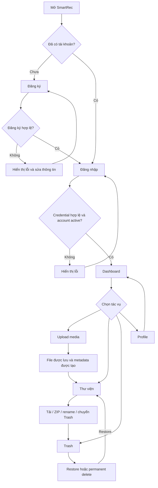
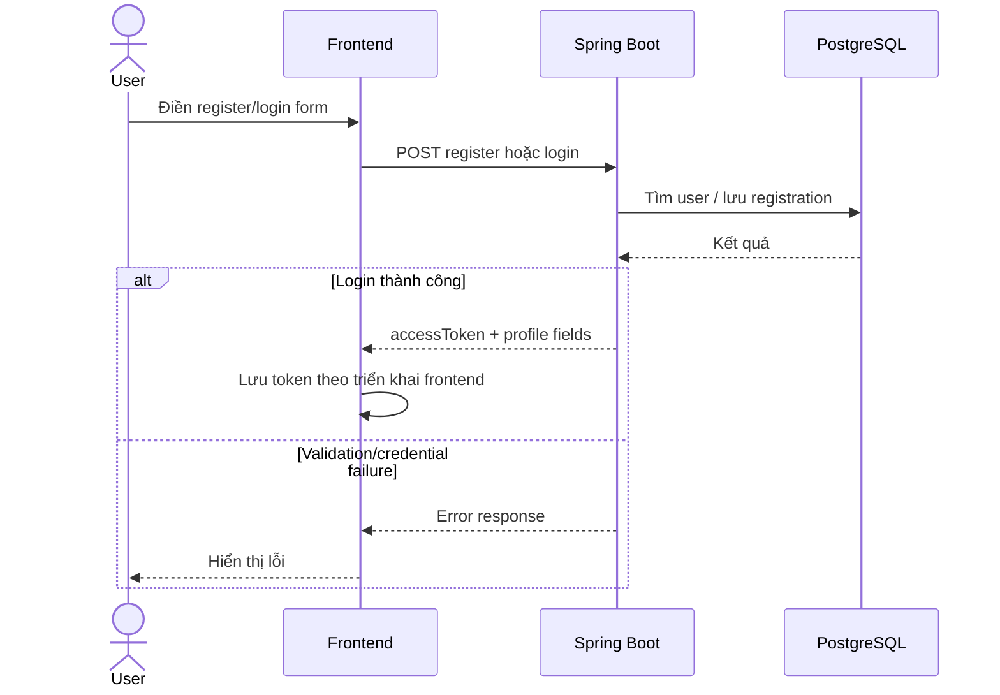
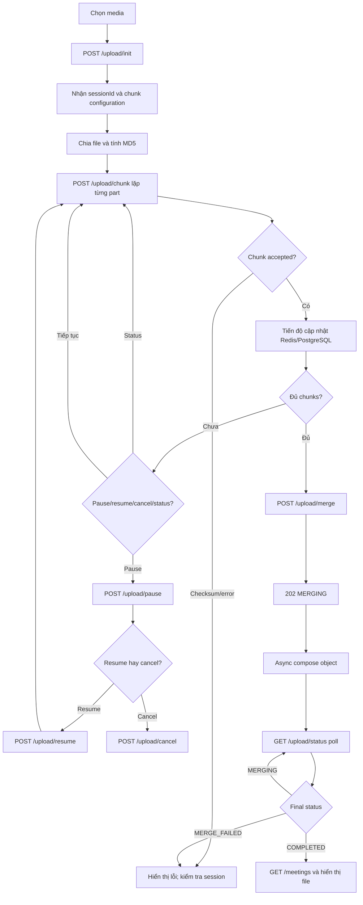

# SmartRec - User Workflows

**Trạng thái:** User journeys theo chức năng backend; frontend integration cần xác minh release-by-release.

## 1. Hành trình tổng thể



## 2. Register/Login



Register/login controller mapping có prefix `/api/auth`; full path phụ thuộc context path `/api/v1`, do đó thường là `/api/v1/api/auth/...`. Xác nhận bằng OpenAPI/runtime.

## 3. Upload trực tiếp

Có hai API khả năng direct upload:

```text
Multipart:
User -> chọn file -> POST /meetings/upload (multipart)
     -> validate -> MinIO object put -> save MediaFile + Meeting
     -> response metadata -> refresh library

Presigned:
User -> chọn file -> POST /upload/presign
     -> receive presigned URL + objectKey
     -> browser PUT to MinIO
     -> POST /upload/complete
     -> backend verify object/size/key -> save metadata
     -> refresh library
```

UI nào dùng nhánh nào phải kiểm tra trên component/service của release cụ thể.

## 4. Upload theo chunk (backend workflow; UI cần xác minh)



`useChunkUpload.js` hiện được rà soát là mock. Trên UI thực tế không cam kết workflow này hoạt động tới khi API wiring được nghiệm thu.

## 5. Library actions

- **List/search/filter:** user mở library, query có pagination/status/keyword/sort; server giới hạn page size tối đa 100.
- **Download:** backend kiểm tra tài nguyên theo user, stream object từ MinIO.
- **ZIP:** user gửi danh sách UUID; backend stream archive; selection rỗng bị từ chối.
- **Rename:** backend validate tên; hiện chấp nhận filename ký tự chữ/số/dot/underscore/hyphen và extension media được hỗ trợ.
- **Move to Trash:** soft-delete metadata; object vẫn ở MinIO cho tới permanent delete/purge.

## 6. Trash lifecycle

```text
Library -> soft-delete -> TRASHED
Trash -> restore -> previous status (fallback UPLOADED)
Trash -> permanent delete -> remove object from MinIO -> delete meeting/media rows
Retention expires -> scheduled purge attempts same object + metadata deletion
```

Purge schedule và retention do environment/config quyết định. Permanent delete không thể hoàn tác.

## 7. Profile actions

Backend API: `GET /api/user/me`, `PUT /api/user/me`, `PUT /api/user/change-password` (cộng context path). Profile page tồn tại trong frontend; endpoint wiring/validation cần xác minh trước user manual release.

## 8. Chưa phải user workflow

AI transcription/summary/NLP/vision/semantic search không đưa vào workflow hiện hành cho tới khi xác nhận API/task dispatch, status/persistence, quyền truy cập kết quả và UI.
