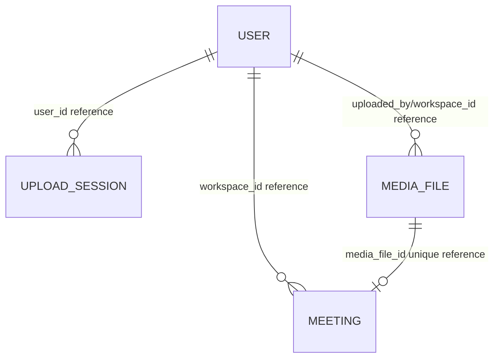

# SmartRec - Data Model and Data Dictionary

**Trạng thái:** Logical model inferred from JPA entities. Physical schema must be verified against the target database.

## 1. Logical entity map

These are logical references inferred from UUID fields. The reviewed entities do not declare JPA object relationships; confirm actual FK constraints/migrations before treating these as enforced database relationships.

## 2. Entity dictionary

### `users`

| Field | Type/model | Meaning | Notes |
|---|---|---|---|
| id | UUID | User key | Generated |
| user_code | String(30) | User-facing code | Unique, generated `SMR` + date + random suffix |
| email | String | Email | Lookup/unique intent |
| phone | String | Phone | Lookup/unique intent |
| password_hash | String | Encoded password | BCrypt service usage |
| full_name | String | Display name | Required |
| department, position | String | Profile fields | Optional |
| is_active | Boolean | Account state | Login blocks inactive account |
| created_at, updated_at, delete_at | Instant | Lifecycle timestamps | `delete_at` semantics require confirmation |

### `meetings`

| Field | Type/model | Meaning | Notes |
|---|---|---|---|
| id | UUID | Meeting key | Generated |
| workspace_id | UUID | Workspace owner/reference | Upload code sets to current user |
| media_file_id | UUID | Media reference | Unique, required |
| title | String(500) | Meeting title | Required |
| processing_mode | String(50) | Processing mode | Semantics not established |
| status | Enum | `PENDING`, `PROCESSING`, `COMPLETED`, `FAILED` | Do not infer AI feature without processor |
| active_job_id | UUID | Active job reference | Job lifecycle not verified |
| created_at, updated_at, deleted_at | Instant | Timestamps | `deleted_at` exists but meeting soft delete uses media status |

### `media_file`

| Field | Type/model | Meaning | Notes |
|---|---|---|---|
| id | UUID | Media key | Generated |
| workspace_id, uploaded_by | UUID | Workspace/user references | Ownership checks use service logic |
| original_name | String(500) | Current display filename | Renamed in library |
| object_key | String(1000) | MinIO key | Required |
| multipart_upload_id | String | Multipart reference | Optional |
| mime_type | String(100) | Media content type | Required |
| file_size_bytes | Long | Size | Required |
| duration_seconds | Integer | Duration | Optional |
| status | String | UPLOADING/UPLOADED/TRASHED/PURGED | Defined constants |
| previous_status | String | Pre-trash status | Used by restore |
| deleted_at, purge_at | Instant | Trash retention timestamps | Used by trash listing/purge |
| deleted_by | UUID | Deleting user reference | Optional |
| created_at | Instant | Creation time | Creation timestamp |

### `upload_sessions`

| Field | Type/model | Meaning |
|---|---|---|
| id | UUID | Upload session ID |
| user_id | UUID | Owner reference |
| total_chunks | Integer | Expected chunk count |
| received_chunks | Integer | Persisted progress |
| status | Enum | Upload lifecycle status |
| created_at, updated_at | Instant | Session timestamps |

Additional filename/size/chunk details are held in the Redis/model upload session representation, not all in the reviewed JPA entity.

## 3. Status values

- Upload: `INITIATED`, `UPLOADING`, `PAUSED`, `READY_TO_MERGE`, `MERGING`, `COMPLETED`, `MERGE_FAILED`, `FAILED`, `CANCELLED`.
- Media: `UPLOADING`, `UPLOADED`, `TRASHED`, `PURGED`.
- Meeting: `PENDING`, `PROCESSING`, `COMPLETED`, `FAILED`.

## 4. Storage ownership

- PostgreSQL stores structured records.
- Redis stores runtime upload session state/progress; persistence/TTL policy should be verified in Redis service implementation and runtime configuration.
- MinIO stores file bytes and temporary chunk objects. A metadata row is not itself the object.

## 5. Physical schema checklist

Before publishing ERD: extract schema from target DB; document exact SQL types, nullability, unique indexes, FK/index constraints, migration/versioning, cascade behavior and retention. JPA `ddl-auto: update` is currently configured in app YAML; production migration strategy must be explicitly selected.
