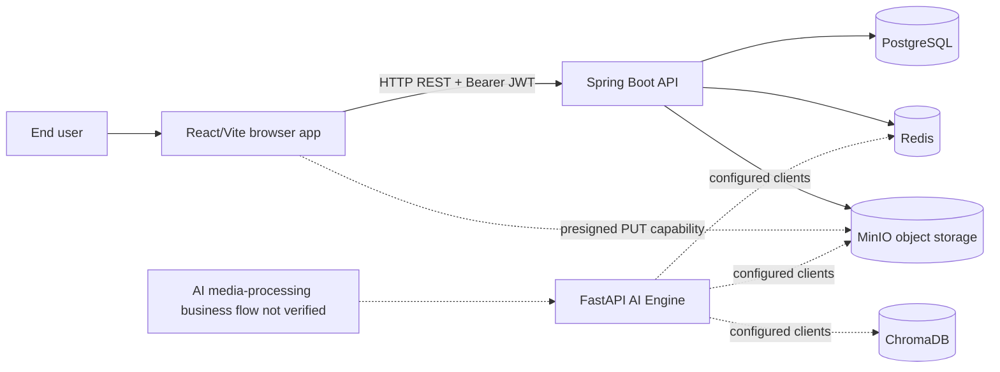
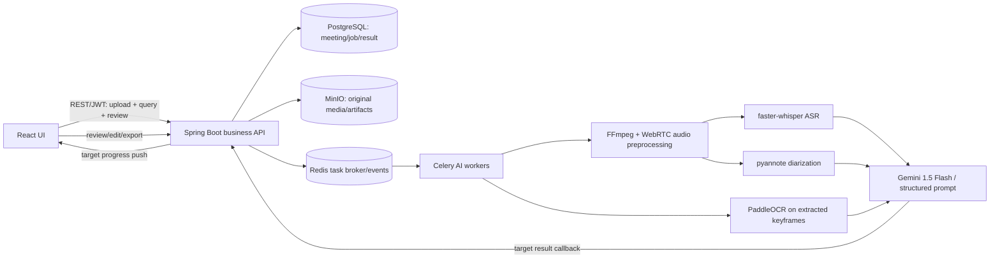

# SmartRec - System Architecture

**Trạng thái:** As-built logical overview từ repository; chưa phải production deployment design.

## 1. System context



The dashed AI/client edges indicate configured capabilities; do not interpret them as a verified end-to-end product workflow.

## 2. Components and responsibilities

| Component | Technology | Responsibilities verified in source |
|---|---|---|
| Frontend | React, Vite | Pages/components for auth, dashboard, meetings, Trash, profile and upload; actual endpoint wiring must be checked per screen |
| API backend | Java 17, Spring Boot 3.1.5 | Auth/JWT, user profile APIs, file upload, meeting/media lifecycle and Trash |
| PostgreSQL | PostgreSQL 15 image in Compose | Persistent user, upload session and media/meeting metadata |
| Redis | Redis 7 image | Upload session state/progress support |
| MinIO | S3-compatible object storage | Media binary objects, chunks, compose/download/delete and presigned PUT |
| AI Engine | FastAPI + Celery | Root/health routes and a ping task are present; no media-processing worker pipeline or end-to-end integration is verified |
| ChromaDB | Chroma image | Configured AI vector-store dependency; use in product workflow not verified |

## 3. Backend layers

```text
HTTP request
  -> Spring Security JWT filter
  -> Controller
  -> Service interface / implementation
  -> Repository (JPA) / Redis service / MinIO service
  -> PostgreSQL, Redis, MinIO
```

Key packages: `controller`, `service`, `service/impl`, `repository`, `entity`, `model/dto`, `security`, `config`, `exception`.

## 4. Data flows

### Chunk upload

Client initializes session; backend stores persistent session and Redis snapshot. Chunks are checksum checked and stored as temporary MinIO objects. Backend progress is updated, then async merge composes a final object, saves/reuses MediaFile and Meeting, updates statuses and attempts temporary chunk cleanup.

### Direct upload

Either backend receives multipart content and stores it in MinIO, or client obtains a presigned PUT URL, uploads to MinIO and calls complete. Backend verifies object key/size and creates metadata.

### Download and deletion

Download validates meeting ownership before reading MinIO. Move-to-trash updates DB metadata only. Permanent deletion removes MinIO object first, then Meeting and MediaFile rows.

## 5. Deployment topology (development)

`docker-compose.yml` defines PostgreSQL, Redis, MinIO, a MinIO init helper, ChromaDB and AI Engine. Spring Boot API and Vite frontend are run separately per root README. Ports shown in repository are development defaults; production topology, ingress/TLS, persistent storage, backups, scaling and secret provisioning are TBD.

## 6. Trust boundaries

- Browser-to-API: HTTPS is required for production; local examples use HTTP.
- Browser-to-MinIO: presigned URL is a temporary bearer capability; do not log or share it.
- API-to-datastores: credentials must be private and environment-specific.
- AI service access and task dispatch: not assumed to exist just because client configuration is present.

## 7. Architecture decisions/open questions

- Confirm whether workspace is per-user or shared; current upload sets workspace ID to current user ID.
- Confirm authoritative API base path and public ingress routes.
- Define production scaling and async worker capacity; current merge runs through application task executor.
- Establish transaction/consistency behavior across PostgreSQL and MinIO failures.
- Confirm ChromaDB and AI processing are required dependencies or optional future services.

## 8. Target architecture in Proposal/URD (not the current deployed flow)



The manual documents mention Redis/Celery, WebSocket progress and worker callback, but the repository-reviewed AI worker only has a ping task and the FastAPI service exposes health/root routes. No end-to-end dispatch/result contract has been verified. This diagram is a proposal target only; protocol, provider, failure/retry, data retention and security boundaries require design approval.

## 9. Current vs target boundary

| Concern | Current evidence | Target requirement |
|---|---|---|
| Upload | Presigned and chunk upload flow wired by active frontend upload stores; MinIO + metadata | Validate duration and create AI job after successful ingest |
| Async work | Backend asynchronous chunk merge; no verified AI task queue dispatch | Redis/Celery worker pipeline |
| AI service | FastAPI health/root and Celery ping task | Audio, diarization, OCR, LLM pipeline |
| Progress | Chunk upload status endpoint and UI polling | Per-job real-time AI progress by WebSocket or approved alternative |
| Results | No verified transcript/summary/task entities or result APIs | Persist output; human review/edit before export |
| Export | No verified report API | DOCX/PDF/JSON/CSV and import-compatible output |

See [Source Reconciliation](./appendices/source-reconciliation.md) for decisions and source references.
