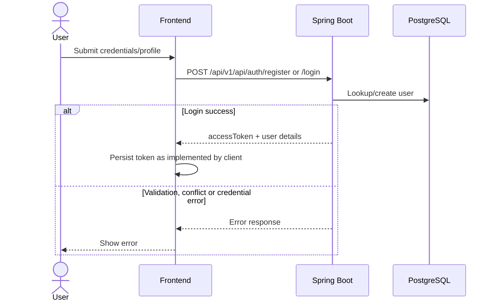
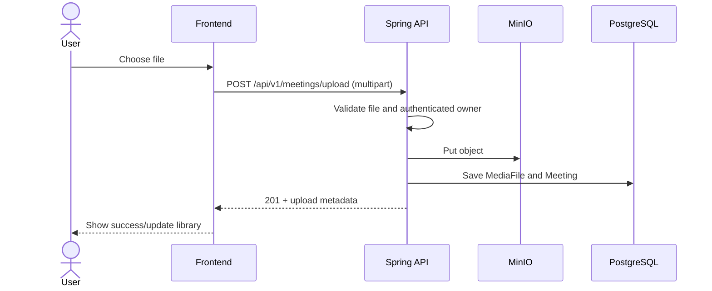
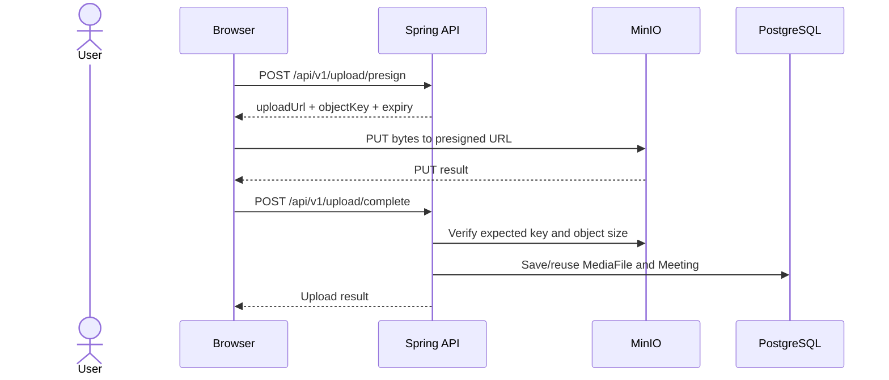
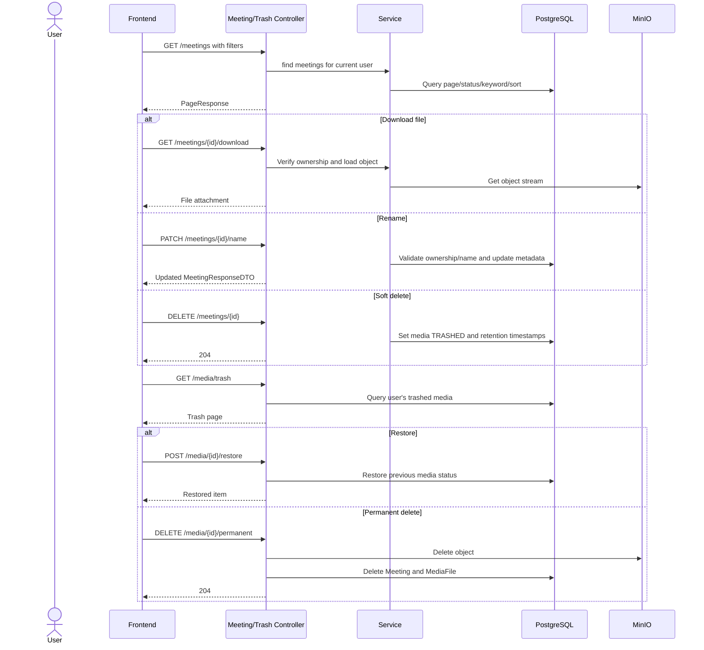
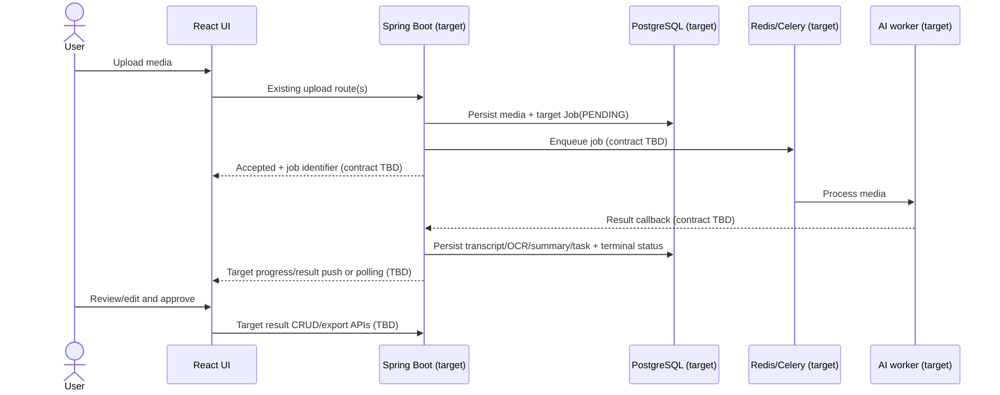

# SmartRec - API Workflows

**Trạng thái:** As-built upload/library sequences plus a clearly separated target AI workflow.

## 1. Common request path

```text
Browser -> base URL + context path (/api/v1)
        -> Spring Security JWT filter
        -> Controller mapping
        -> Service
        -> PostgreSQL / Redis / MinIO
        -> HTTP response -> frontend state/UI
```

Authentication routes are public. Protected endpoints require Bearer token. Error response should be mapped to client UI; exact status/error body is governed by global exception handler.

## 2. Registration/login sequence



## 3. Direct multipart flow



## 4. Presigned upload flow



Presigned URL is sensitive and short-lived. Do not log it or assume browser PUT succeeds until client checks its response.

## 5. Chunk upload and asynchronous merge

```mermaid
sequenceDiagram
    actor User
    participant FE as Frontend
    participant API as UploadController
    participant SVC as UploadService
    participant PG as PostgreSQL
    participant R as Redis
    participant M as MinIO
    participant W as Async merge service
    FE->>API: POST /upload/init + JWT
    API->>SVC: validate and initialize
    SVC->>PG: persist upload session
    SVC->>R: save upload metadata/state
    API-->>FE: sessionId, chunkSize, totalChunks
    loop Each chunk
        FE->>API: POST /upload/chunk (multipart + MD5)
        API->>SVC: validate session/owner/checksum
        SVC->>M: save tmp chunk
        SVC->>R: mark chunk uploaded
        SVC->>PG: update progress/status
        API-->>FE: chunk accepted or error
    end
    FE->>API: POST /upload/merge
    API->>SVC: verify completeness and prepare job
    API-->>FE: 202 Accepted / MERGING
    SVC->>W: dispatch asynchronous merge
    W->>M: compose final object and verify size
    W->>PG: persist MediaFile + Meeting; mark completed
    W->>R: update session state
    W->>M: attempt temporary chunk cleanup
    loop Until terminal state
        FE->>API: GET /upload/status?uploadSessionId=...
        API->>SVC: load status (Redis/DB fallback as implemented)
        API-->>FE: status and progress
    end
```

Possible terminal outcomes include `COMPLETED`, `MERGE_FAILED`, `FAILED`, or `CANCELLED`. Exact retry behavior should be verified from service state transitions. A response `202` only means accepted/in-progress.

## 6. Library and Trash sequence



## 7. Target AI API/workflow (no verified endpoint contract)

The Proposal/URD target implies an API/job contract but does not establish implemented endpoint paths or schemas. The intended sequence is:



No AI job submission, callback, WebSocket route, transcript/result CRUD or report export path is cataloged in the as-built API reference. Do not invent URLs or promise compatibility until API design and OpenAPI contracts are approved.

## 8. UI integration evidence checklist

For each release, record page/component → API service/hook → endpoint → observed request/response → tested result. Active UploadPage uses `useSingleUploadStore`/`useLargeUploadStore` and API services in source; legacy `useSmartUpload.js`/`useChunkUpload.js` simulate progress and are not evidence for the active path. Capture runtime evidence separately.
