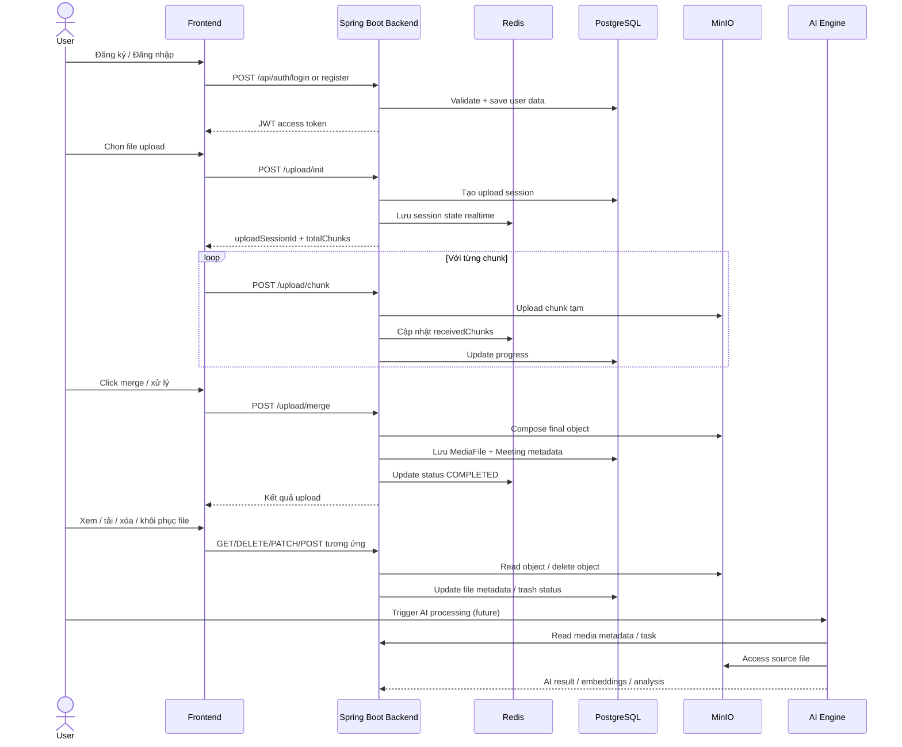
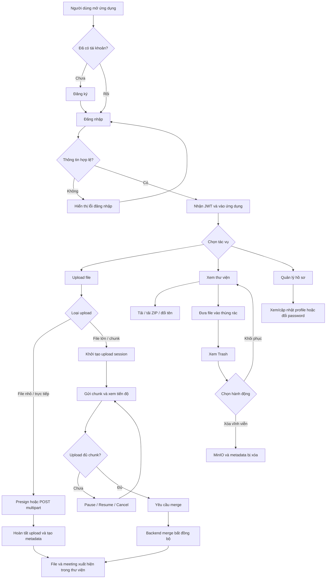
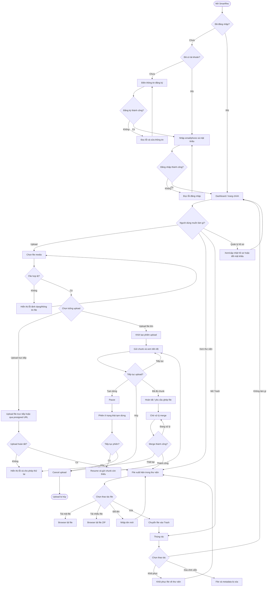
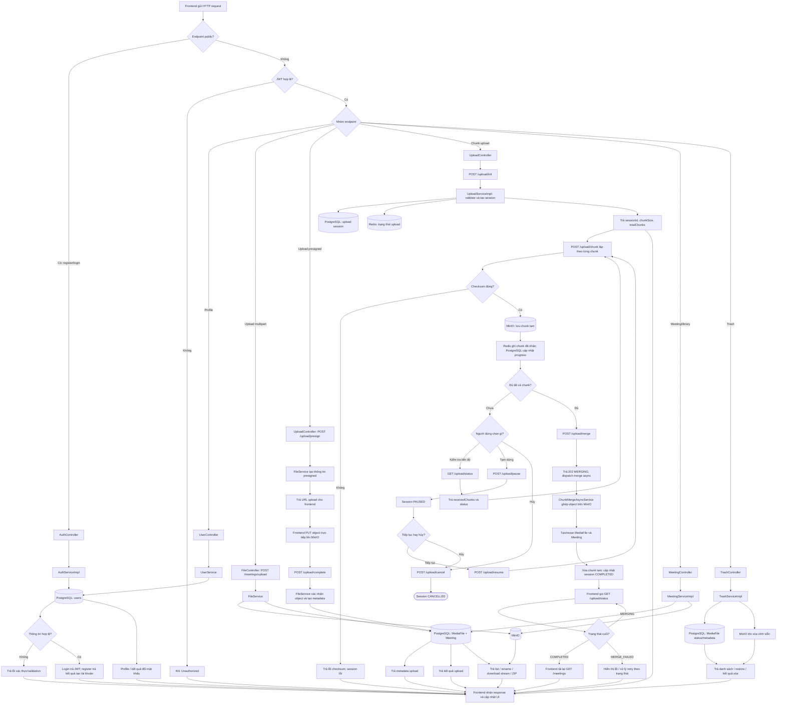
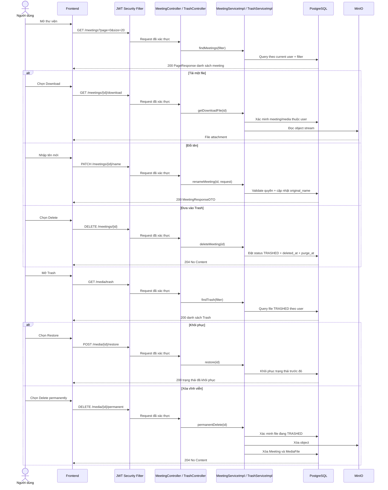

# SmartRec - Tổng hợp source code hiện tại

## 1. Tổng quan dự án

SmartRec là hệ thống quản lý file/media, upload lớn, phân loại meeting/media, và tích hợp nền AI phục vụ xử lý nội dung media. Dự án hiện có 3 thành phần chính:

- Backend Java/Spring Boot: xử lý API, xác thực JWT, quản lý user, upload, meeting, thùng rác, dữ liệu PostgreSQL, MinIO, Redis.
- Frontend React + Vite: giao diện người dùng, upload file, hiển thị danh sách meeting/media, xác thực, quản lý file.
- AI Engine FastAPI: service nền AI, health check, tích hợp với Redis/MinIO/ChromaDB để hỗ trợ xử lý dữ liệu media trong tương lai.

Theo source code hiện tại, hệ thống đang tập trung mạnh vào:
- Đăng ký / đăng nhập / JWT
- Upload file media (bao gồm upload lớn theo chunk)
- Quản lý meeting/media file
- Chuyển vào thùng rác / khôi phục / xóa vĩnh viễn
- Tích hợp storage MinIO và cache Redis
- Mở rộng cho pipeline AI bằng FastAPI

---

## 2. Cấu trúc module chính

### 2.1 Backend (Spring Boot)

Đường dẫn chính: `src/main/java/com/example/smartrec`

Các layer chính:
- `controller/`: API REST layer
- `service/` và `service/impl/`: business logic
- `repository/`: truy cập dữ liệu JPA
- `entity/`: model dữ liệu PostgreSQL
- `model/dto/`: request/response DTO
- `security/`: JWT filter, xác thực
- `config/`: security, CORS, Spring config
- `exception/`: custom exception + global handler

### 2.2 Frontend (React)

Đường dẫn chính: `Frontend/smartrec-frontend/src`

Các thành phần chính:
- `api/`: axios client và API call
- `features/files/`: hook upload file, chunk upload
- `hooks/`: state và logic upload dài hạn
- `lib/http/`: interceptor, error handling
- `store/`: auth state
- `services/`: service layer cho việc gọi backend

### 2.3 AI Engine (FastAPI)

Đường dẫn chính: `ai-engine/app`

Các module chính:
- `api/routes.py`: endpoint health/root
- `core/config.py`: cấu hình settings cho Redis, MinIO, Chroma
- `services/`: client cho ffmpeg, minio, chroma
- `pipelines/`: pipeline xử lý audio, NLP, vision
- `workers/tasks.py`: task nền cho AI jobs

---

## 3. Chức năng hiện có

### 3.1 Xác thực người dùng

Dịch vụ xác thực nằm ở:
- `AuthController`
- `AuthServiceImpl`
- `UserRepository`
- `JwtService`, `JwtAuthenticationFilter`
- `SecurityConfig`

Chức năng:
- `POST /api/auth/register`: đăng ký account mới
- `POST /api/auth/login`: đăng nhập, kiểm tra password, sinh JWT
- Mật khẩu lưu bằng `BCryptPasswordEncoder`
- JWT được đọc ở `Authorization: Bearer ...`
- Tất cả route khác ngoại trừ register/login đều bị yêu cầu xác thực

Cách hoạt động:
1. Client gửi email/phone + password
2. Backend kiểm tra email/phone đã tồn tại chưa
3. Tạo `userCode` theo format `SMRyyyyMMddXXXX`
4. Lưu `User` vào PostgreSQL
5. Login thực hiện verify password và trả JWT + thông tin user

---

### 3.2 Upload file media

Các endpoint chính:
- `POST /upload/init`
- `POST /upload/chunk`
- `POST /upload/merge`
- `GET /upload/status`
- `POST /upload/pause`
- `POST /upload/resume`
- `POST /upload/cancel`
- `POST /upload/presign`
- `POST /upload/complete`

Dựa trên `UploadServiceImpl`, hệ thống hỗ trợ upload theo chunk cho file media, chủ yếu định dạng:
- `.mp3`
- `.mp4`
- `.m4a`
- `.mkv`

Upload session được quản lý qua hai nguồn:
- PostgreSQL: lưu trạng thái persistent
- Redis: lưu trạng thái realtime và bộ đếm chunk đã upload

Các trạng thái upload:
- `INITIATED`
- `UPLOADING`
- `PAUSED`
- `READY_TO_MERGE`
- `MERGING`
- `COMPLETED`
- `MERGE_FAILED`
- `FAILED`
- `CANCELLED`

Cấu trúc dữ liệu lưu trên upload:
- `UploadSession` (model): session metadata
- `UploadSessionRepository` (DB)
- `UploadSessionRedisService` (cache)

Kiểm tra chunk:
- Tính MD5 checksum cho từng chunk
- So sánh với checksum client gửi lên
- Nếu mismatch: reject
- Nếu ok: upload chunk lên MinIO vào prefix `tmp/{sessionId}/chunk_{index}`

Quá trình merge:
- Khi đủ số chunk, hệ thống chuẩn bị merge
- `ChunkMergeAsyncService` chạy async
- Gộp các chunk thành object cuối cùng trong MinIO (`finalObjectKey`)
- Xóa chunk tạm sau khi merge xong
- Tạo hoặc update `MediaFile` và `Meeting`
- Cập nhật trạng thái `UPLOADED`, `PENDING`, `PROCESSING`, ...

---

### 3.3 Quản lý meeting / file media

API chính:
- `GET /meetings` -> danh sách meeting/media theo page, filter, search
- `DELETE /meetings/{id}` -> chuyển file sang thùng rác
- `GET /meetings/{id}/download` -> tải một file
- `POST /meetings/download` -> tải zip nhiều file
- `PATCH /meetings/{id}/name` -> đổi tên file

Các model liên quan:
- `Meeting`
- `MediaFile`
- `MeetingStatus`
- `MediaFileStatus`

`MeetingStatus` hiện tại gồm:
- `PENDING`
- `PROCESSING`
- `COMPLETED`
- `FAILED`

`MediaFileStatus` gồm:
- `UPLOADING`
- `UPLOADED`
- `TRASHED`
- `PURGED`

Giải thích nghiệp vụ:
- `Meeting` lưu metadata về file/media gắn với workspace người dùng
- `MediaFile` lưu thông tin object storage, tên gốc, mime type, kích thước
- Khi xóa meeting/media, không xóa ngay khỏi DB/MinIO mà chuyển về trạng thái `TRASHED` và đặt `purge_at`

---

### 3.4 Thùng rác (Trash)

API:
- `GET /media/trash` -> liệt kê file trong thùng rác
- `DELETE /media/{id}` -> chuyển file vào thùng rác
- `POST /media/{id}/restore` -> khôi phục
- `DELETE /media/{id}/permanent` -> xóa vĩnh viễn

Business logic:
- File chỉ xóa vĩnh viễn nếu đang ở trạng thái `TRASHED`
- Khi restore: nếu `previous_status` rỗng thì mặc định chuyển về `UPLOADED`
- Khi permanent delete:
  1. xóa object trong MinIO
  2. xóa `Meeting` liên quan
  3. xóa record `MediaFile`

---

### 3.5 Frontend upload UX

Frontend hiện có hook upload cho nhiều mode:
- `useChunkUpload.js`: mock chunk upload, cập nhật progress, cancel, state phase
- `useSingleUpload.js`: upload đơn lẻ
- `useSmartUpload.js`: wrapper upload thông minh
- `useLargeUploadStore.ts`, `useSingleUploadStore.js`, `useChunkQueue.ts`

Ngoài ra có các service:
- `meetingApi.js`: gọi API danh sách meeting đã xử lý
- `axiosClient.js`, `lib/http/interceptors.js`: cấu hình 인증/response

Lưu ý quan trọng: `useChunkUpload.js` trong source hiện tại đang dùng mock logic (simulate chunk upload bằng setTimeout), không phải gọi API upload thật tới backend. Đây là điểm cần chú ý khi đánh giá nguyên trạng hệ thống.

---

### 3.6 AI Engine

AI Engine nằm trong `ai-engine/` với FastAPI.

Endpoint hiện có:
- `GET /` -> thông tin service
- `GET /health` -> kiểm tra trạng thái, FFmpeg version

Cấu hình hiện tại:
- Redis host/port: `localhost:6379`
- MinIO endpoint: `http://localhost:9000`
- ChromaDB host/port: `localhost:8001`
- Bucket MinIO mặc định: `smartrec-media`

Có các module pipeline dự kiến:
- `audio_pipeline.py`
- `nlp_pipeline.py`
- `vision_pipeline.py`

Như vậy, AI Engine chưa phải là pipeline hoàn chỉnh chạy theo business logic chính, mà mới là nền tảng khung tích hợp để mở rộng.

---

## 4. Workflow nghiệp vụ chính

### 4.1 Luồng đăng nhập / xác thực

```text
Client
  -> POST /api/auth/login
  -> AuthController
  -> AuthServiceImpl
  -> UserRepository
  -> PasswordEncoder verify
  -> JwtService generate JWT
  -> Client nhận accessToken
  -> Authorization header được JwtAuthenticationFilter kiểm tra ở mỗi request
```

### 4.2 Luồng upload file media

```text
Frontend
  -> POST /upload/init
  -> UploadServiceImpl.initUpload()
  -> validate file name/type/size/chunk count
  -> save UploadSession to PostgreSQL
  -> save UploadSession to Redis
  -> client receives uploadSessionId + chunkSize + totalChunks

Client upload từng chunk
  -> POST /upload/chunk
  -> validate session ID + checksum + file
  -> upload chunk to MinIO tmp path
  -> mark uploaded chunk in Redis
  -> update progress in PostgreSQL

Khi tất cả chunk upload xong
  -> POST /upload/merge
  -> UploadServiceImpl.mergeUpload()
  -> async dispatch to ChunkMergeAsyncService
  -> compose final object in MinIO
  -> save MediaFile + Meeting
  -> cleanup chunk temp files
  -> status = COMPLETED
```

### 4.3 Luồng quản lý file và thùng rác

```text
Meeting list/download/rename
  -> MeetingController
  -> MeetingServiceImpl
  -> MeetingRepository / MediaFileRepository
  -> MinIO object operations

Move to trash / restore / permanent delete
  -> TrashController
  -> TrashServiceImpl
  -> verify user access
  -> update MediaFile status + previous_status
  -> delete object in MinIO when permanent
```

### 4.4 Luồng AI service

```text
AI Engine startup
  -> FastAPI app
  -> app/api/routes.py
  -> /health route
  -> connects to Redis / MinIO / Chroma config
  -> future pipeline jobs can consume media metadata and run audio/NLP/vision processing
```

### 4.5 Workflow chi tiết theo góc nhìn người dùng

Dưới đây là các luồng “từ đầu đến cuối” mà người dùng thực sự trải nghiệm khi tương tác với hệ thống, không chỉ nhìn ở mức API/backend.

#### 4.5.1 Người dùng đăng ký tài khoản

```text
1. User mở màn hình Register
2. Nhập email, số điện thoại, mật khẩu, họ tên
3. Frontend gọi POST /api/auth/register
4. Backend kiểm tra email/phone đã tồn tại chưa
5. Nếu trùng -> trả lỗi conflict
6. Nếu hợp lệ -> tạo User mới, mã userCode tự sinh (SMRyyyyMMddXXXX)
7. Password được mã hóa bằng BCrypt
8. Server lưu vào PostgreSQL
9. User nhận thông báo "đăng kí thành công" và chuyển sang Login
```

#### 4.5.2 Người dùng đăng nhập

```text
1. User nhập email/phone + password trên màn hình Login
2. Frontend gửi POST /api/auth/login
3. Backend tìm user theo email hoặc phone
4. Nếu tài khoản bị khóa -> reject
5. Nếu mật khẩu sai -> reject
6. Nếu đúng -> tạo JWT access token
7. Backend trả về accessToken + user info
8. Frontend lưu token vào local storage/session
9. Mỗi request sau đó tự động gắn Authorization: Bearer <token>
10. JwtAuthenticationFilter kiểm tra token tại mọi protected route
```

#### 4.5.3 Người dùng upload file media

```text
Bước 0: User chọn file có định dạng mp3/mp4/m4a/mkv

Bước 1: Khởi tạo session
1. Frontend gọi POST /upload/init
2. Backend validate tên file, loại file, kích thước, số chunk
3. Tạo UUID uploadSessionId
4. Lưu UploadSession vào PostgreSQL
5. Lưu phiên bản realtime vào Redis
6. Backend trả về:
   - uploadSessionId
   - totalChunks
   - chunkSize
   - status = INITIATED

Bước 2: Upload từng chunk
1. Frontend chia file thành các chunk theo 5MB (hoặc giá trị tương ứng)
2. Với mỗi chunk:
   - gửi chunkIndex, checksumMD5, file data
   - server validate uploadSessionId
   - server tính MD5 và kiểm tra checksum
   - nếu đúng -> lưu lên MinIO tmp/{sessionId}/chunk_{index}
   - update Redis: đã upload chunk nào, số lượng chunk nhận được
   - update PostgreSQL: tiến độ upload
3. UI hiển thị tiến độ: 12%, 25%, 78% ...

Bước 3: Khi tất cả chunk đã nhận đủ
1. Server chuyển trạng thái sang READY_TO_MERGE
2. User click "Xử lý / Hoàn tất upload"
3. Frontend gọi POST /upload/merge
4. Backend kiểm tra đủ chunk và không thiếu file
5. Dispatch job merge async
6. Server tạo final object trong MinIO bằng cách ghép các chunk lại
7. Xóa các chunk tạm trong MinIO
8. Lưu metadata file mới vào MediaFile
9. Tạo hoặc cập nhật Meeting
10. Trạng thái cuối cùng: COMPLETED / MERGING / FAILED tùy tiến độ thực thi
```

#### 4.5.4 Người dùng kiểm tra trạng thái upload

```text
1. User mở màn hình Upload hoặc Dashboard
2. Hệ thống gọi GET /upload/status?uploadSessionId=...
3. Backend đọc session trong Redis nếu còn sẵn
4. Nếu Redis hết hạn hoặc không có data -> fallback đọc PostgreSQL
5. Server trả về:
   - receivedChunks
   - totalChunks
   - status (INITIATED, UPLOADING, PAUSED, READY_TO_MERGE, MERGING, COMPLETED...)
6. User quan sát tiến độ, có thể tạm dừng, tiếp tục, hủy hoặc retry
```

#### 4.5.5 Người dùng tạm dừng, tiếp tục, hủy upload

```text
Tạm dừng:
1. User bấm Pause
2. Frontend gọi POST /upload/pause
3. Backend cập nhật trạng thái PAUSED trong Redis và PostgreSQL
4. Tất cả upload tiếp theo sẽ dừng cho session này

Tiếp tục:
1. User bấm Resume
2. Frontend gọi POST /upload/resume
3. Backend đánh dấu trạng thái quay lại UPLOADING
4. Các chunk còn thiếu có thể upload tiếp

Hủy:
1. User bấm Cancel
2. Frontend gọi POST /upload/cancel
3. Backend đánh dấu CANCELLED
4. Dọn dẹp session và chunk nếu cần
```

#### 4.5.6 Người dùng xem danh sách file/meeting

```text
1. User vào dashboard hoặc giao diện Meeting List
2. Frontend gọi GET /meetings
3. Backend xác thực JWT, lấy user hiện tại
4. Query các meeting/media thuộc workspace của user theo:
   - page
   - size
   - status
   - keyword search
   - sort field
5. Backend trả về PageResponse<MeetingResponseDTO>
6. Frontend hiển thị danh sách file, tên, trạng thái, thời gian, kích thước
```

#### 4.5.7 Người dùng tải file / tải zip / đổi tên file

```text
Tải một file:
1. User click Download trên một item
2. Frontend gọi GET /meetings/{id}/download
3. Backend lấy file metadata và stream từ MinIO
4. Server trả về file attachment cho browser

Tải nhiều file cùng lúc:
1. User chọn nhiều item
2. Frontend gửi POST /meetings/download với body chứa mảng UUID
3. Backend tạo một file ZIP và trả về stream ZIP
4. Browser download file smartrec-files.zip

Đổi tên file:
1. User chỉnh tên file trong giao diện
2. Frontend gọi PATCH /meetings/{id}/name
3. Backend validate tên file: đúng định dạng, đúng extension, không rỗng
4. Cập nhật original_name trong MediaFile
5. Frontend hiển thị tên mới ngay tại list
```

#### 4.5.8 Người dùng xóa file và đưa vào thùng rác

```text
1. User click Delete / Move to trash
2. Frontend gọi DELETE /meetings/{id}
3. Backend lấy meeting + media file thuộc user
4. Nếu file đã ở TRASHED thì báo lỗi
5. Nếu hợp lệ -> cập nhật:
   - status = TRASHED
   - deleted_at = now
   - purge_at = now + retention period
   - deleted_by = userId
6. File không bị xóa hẳn ngay, mà “ẩn” khỏi danh sách active và chuyển vào thùng rác
```

#### 4.5.9 Người dùng xem thùng rác và khôi phục file

```text
1. User vào màn hình Trash
2. Frontend gọi GET /media/trash
3. Backend lọc các MediaFile có status = TRASHED và thuộc user
4. Server trả về danh sách file, thời gian xóa, ngày purge còn lại

Khôi phục:
1. User chọn Restore
2. Frontend gọi POST /media/{id}/restore
3. Backend kiểm tra file đang ở TRASHED
4. Hệ thống đặt lại previous_status nếu trước đó từng là UPLOADED/UPLOADING
5. Status trở lại trạng thái trước đó
6. File lại xuất hiện trong danh sách file chính

Xóa vĩnh viễn:
1. User chọn Delete permanently
2. Frontend gọi DELETE /media/{id}/permanent
3. Backend xóa object trong MinIO
4. Xóa Meeting liên quan
5. Xóa bản ghi MediaFile trong PostgreSQL
6. File biến mất khỏi hệ thống
```

#### 4.5.10 Người dùng tương tác với AI Engine (tương lai)

```text
1. User upload media hoặc file đã ở hệ thống
2. Hệ thống có thể trigger AI pipeline dựa trên metadata của file
3. AI Engine nhận task từ backend hoặc queue worker
4. FastAPI service đọc config Redis/MinIO/ChromaDB
5. Mô hình audio/NLP/vision được chạy trên file media
6. Kết quả AI được lưu lại, phản hồi về UI hoặc dùng cho các workflow tiếp theo
```

Tóm lại, nếu nhìn từ góc độ người dùng, toàn bộ hệ thống không phải là một “api call đơn lẻ”, mà là chuỗi trải nghiệm liên tục:
- đăng ký -> đăng nhập -> xác thực -> upload -> theo dõi tiến độ -> merge -> lưu metadata -> quản lý -> tải / đổi tên / xóa / khôi phục -> mở rộng lên xử lý AI.

### 4.6 Bản đồ màn hình và API tương ứng

Nếu nhìn theo từng màn hình mà người dùng thao tác, luồng hoạt động có thể mô tả như sau:

- Màn hình Login/Register
  - User action: nhập thông tin, nhấn Login/Register
  - Frontend call: `POST /api/auth/login`, `POST /api/auth/register`
  - Backend xử lý: `AuthController`, `AuthServiceImpl`
  - Dữ liệu: `users` table, `password_hash`, JWT

- Màn hình Upload
  - User action: chọn file, nhấn upload
  - Frontend call: `POST /upload/init`, `POST /upload/chunk`, `POST /upload/merge`, `GET /upload/status`
  - Backend xử lý: `UploadServiceImpl`, `ChunkMergeAsyncService`
  - Dữ liệu: `upload_sessions`, Redis session state, MinIO temporary chunks

- Màn hình Dashboard / Library
  - User action: xem danh sách file, tìm kiếm, lọc trạng thái
  - Frontend call: `GET /meetings`
  - Backend xử lý: `MeetingController`, `MeetingServiceImpl`
  - Dữ liệu: `meetings`, `media_file`, `user` relation

- Màn hình File detail / action menu
  - User action: tải một file, tải zip, đổi tên, xóa
  - Frontend call: `GET /meetings/{id}/download`, `POST /meetings/download`, `PATCH /meetings/{id}/name`, `DELETE /meetings/{id}`
  - Backend xử lý: `MeetingServiceImpl`, MinIO read/write, metadata update

- Màn hình Trash
  - User action: xem thùng rác, restore, xóa vĩnh viễn
  - Frontend call: `GET /media/trash`, `POST /media/{id}/restore`, `DELETE /media/{id}/permanent`
  - Backend xử lý: `TrashServiceImpl`
  - Dữ liệu: `media_file.status`, `previous_status`, `deleted_at`, `purge_at`

- Màn hình AI / future workflow
  - User action: trigger AI processing cho file
  - Frontend call: tương lai hoặc backend internal queue
  - Backend xử lý: AI Engine, Redis, MinIO, ChromaDB

### 4.7 Sequence diagram dạng tổng quát



### 4.8 Timeline trạng thái của một file từ upload đến lưu trữ cuối cùng

```text
INITIATED
  -> UPLOADING
  -> PAUSED (nếu user ngừng)
  -> READY_TO_MERGE
  -> MERGING
  -> COMPLETED

Nếu lỗi hoặc checksum không hợp lệ:
  INITIATED/UPLOADING -> FAILED

Nếu user hủy:
  INITIATED/UPLOADING/PAUSED -> CANCELLED

Sau khi đã hoàn tất và hiển thị trong dashboard:
  MediaFile.status = UPLOADED
  Meeting.status = PENDING/PROCESSING/COMPLETED/FAILED

Khi user xóa file:
  MediaFile.status = TRASHED
  deleted_at / purge_at được ghi nhận

Khi restore:
  TRASHED -> previous_status (ví dụ UPLOADED)

Khi permanent delete:
  TRASHED -> MinIO delete + DB delete
```

### 4.9 User journey theo vai trò

#### 4.9.1 Vai trò End User

```text
- Đăng ký tài khoản
- Đăng nhập và nhận JWT
- Chọn file media
- Chờ upload chunk và theo dõi tiến độ
- Chỉnh sửa tên file nếu cần
- Tải xuống file hoặc zip
- Xem dashboard
- Chuyển file vào thùng rác
- Khôi phục hoặc xóa vĩnh viễn
```

#### 4.9.2 Vai trò System Operator / Admin

```text
- Giám sát trạng thái upload session
- Kiểm tra progress trên Redis/PostgreSQL
- Xem lỗi upload, merge failed
- Theo dõi MinIO object storage
- Xác minh file đã được merge và lưu metadata rõ ràng
- Duyệt tài nguyên trong thùng rác theo retention policy
```

#### 4.9.3 Vai trò AI Engineer / Backend Integrator

```text
- Đọc metadata file từ Meeting và MediaFile
- Xác định source object trong MinIO
- Kết nối AI Engine với Redis/MinIO/ChromaDB
- Trigger pipeline xử lý audio/NLP/vision
- Lưu kết quả AI dưới dạng metadata hoặc tài nguyên mới
- Tích hợp task queue để chạy background process
```

### 4.10 Các luồng lỗi phổ biến và cách hệ thống phản ứng

```text
1. User upload file sai định dạng
   -> validate extension trong UploadServiceImpl.initUpload()
   -> trả lỗi ERR_INVALID_FILE_TYPE

2. User gửi checksum sai cho chunk
   -> uploadChunkInternal() tính MD5 và so sánh
   -> reject với CHECKSUM_MISMATCH

3. Redis session hết hạn hoặc không tìm thấy dữ liệu
   -> fallback đọc PostgreSQL
   -> nếu thiếu fileName thì reject UPLOAD_SESSION_REDIS_EXPIRED

4. MinIO lỗi khi upload hoặc compose chunk
   -> trả ERR_MINIO_UNAVAILABLE
   -> cập nhật trạng thái FAILED hoặc MERGE_FAILED

5. File đã ở trong thùng rác nhưng lại xóa tiếp
   -> BusinessException MEDIA_ALREADY_TRASHED / MEDIA_NOT_IN_TRASH

6. Người dùng không có quyền truy cập file
   -> đối chiếu workspace_id hoặc uploaded_by với current user
   -> ResourceNotFoundException / BusinessException

7. Dữ liệu quá lớn, page size không hợp lệ
   -> validate page, size trong MeetingServiceImpl / TrashServiceImpl
   -> BAD_REQUEST với INVALID_PAGINATION
```

### 4.11 Mô hình luồng dữ liệu từ đầu đến cuối

```text
User input
  -> Frontend form / state management
  -> HTTP request
  -> Security filter (JWT check)
  -> Controller
  -> Service business logic
  -> Repository (PostgreSQL)
  -> Redis (realtime session)
  -> MinIO (binary object storage)
  -> Async merge worker
  -> Meeting + MediaFile metadata final
  -> Dashboard / Download / Trash actions
```

Bản chất của hệ thống là: dữ liệu người dùng đi qua 4 tầng phụ trách khác nhau:
- Presentation layer: Frontend UI
- Security layer: JWT validation
- Business layer: Upload/Meeting/Trash services
- Storage layer: PostgreSQL + Redis + MinIO + AI backend

---

## 5. Sơ đồ khối chức năng

```text
┌──────────────────────────────┐
│        Frontend (React)      │
│  login / upload / meeting UI  │
└──────────────┬───────────────┘
               │ HTTP REST / JWT
               ▼
┌──────────────────────────────┐
│     Spring Boot Backend       │
│  Auth / Upload / Meeting /   │
│  Trash / Security / JWT       │
├──────────────────────────────┤
│  PostgreSQL                  │  User + sesion + meeting + media metadata
│  Redis                       │  realtime upload session state
│  MinIO                       │  media object storage
└──────────────┬───────────────┘
               │ async job / integration
               ▼
┌──────────────────────────────┐
│      AI Engine (FastAPI)     │
│  health + pipeline extension │
├──────────────────────────────┤
│  ChromaDB                    │  vector store / semantic retrieval
│  FFmpeg / media processing   │
└──────────────────────────────┘
```

---

## 6. Kiến trúc nền tảng và kích thước code

### 6.1 Công nghệ chính
- Java 17
- Spring Boot 3.1.5
- PostgreSQL
- Redis
- MinIO
- React + Vite
- FastAPI (Python)
- Docker Compose cho môi trường infra

### 6.2 Số lượng file theo module (đếm từ source hiện tại)
- Backend Java: 74 file
- Frontend React/Vite: 74 file
- AI Engine Python: 23 file
- Tổng khoảng: 171 file

### 6.3 Số lượng thành phần chính
- Controller: 7
- Service implementation: 9
- Repository: 5

Từ đó, có thể đánh giá hệ thống hiện đang ở mức:
- cấu trúc monolith backend với nhiều service riêng biệt
- frontend tách module rõ ràng
- AI engine độc lập nhưng còn đang thiết kế nền tảng và chưa gắn hoàn toàn business flow

---

## 7. Điểm đáng chú ý / rủi ro thực trạng

1. Frontend upload lớn hiện đang có logic mock trong `useChunkUpload.js`.
   - Tức là UI có sẵn flow upload nhưng chưa được gắn API thật từ backend.

2. AI Engine đang ở dạng thiết kế nền tảng.
   - Các đường route hiện mới có `/` và `/health`.
   - Chưa có pipeline nghiệp vụ hoàn chỉnh trên media/audio/video.

3. Hệ thống upload được thiết kế rất mạnh cho file lớn.
   - Đã có checksum, Redis state, MinIO object composition, async merge.
   - Đây là điểm mạnh của backend hiện nay.

4. Security có cấu hình rõ ràng.
   - JWT filter + Spring Security + CORS cho phép route authenticated.
   - Tuy nhiên, cần kiểm tra chính xác quyền trên từng workspace nếu hệ thống mở rộng theo multi-tenant.

5. Dữ liệu và status model khá rõ ràng.
   - `MediaFileStatus`, `MeetingStatus`, `UploadSessionStatus` cho phép phân tầng trong xử lý và quản lý lifecycle.

---

## 8. Kết luận

SmartRec hiện tại là một hệ thống có dạng hybrid architecture với 3 thành phần chính: backend API, frontend UX, AI engine. Backend là phần trung tâm và đã phát triển khá đầy đủ cho chức năng xác thực, upload media lớn, quản lý meeting, và thùng rác. Frontend có khung UI và flow upload nhưng chưa hoàn thiện tương ứng với backend thật ở một số vị trí. AI Engine mới ở mức nền móng, chưa tích hợp nghiệp vụ xử lý số liệu đầy đủ.

Nếu cần tiếp theo, có thể tách tiếp thành các báo cáo nhỏ hơn theo mục:
- Backend architecture
- Upload flow detail
- API inventory
- Frontend state flow
- AI engine roadmap

---

## 9. API inventory theo hành động người dùng

Các API dưới đây được tổng hợp từ các controller hiện có. Ngoại trừ đăng ký và đăng nhập, Spring Security mặc định yêu cầu xác thực cho các route còn lại.

| Nhóm | Method + endpoint | Hành động người dùng | Kết quả chính |
|---|---|---|---|
| Auth | `POST /api/auth/register` | Tạo tài khoản | Tạo user; trả thông báo thành công |
| Auth | `POST /api/auth/login` | Đăng nhập bằng email/phone và password | Trả access token và thông tin user |
| Profile | `GET /api/user/me` | Xem hồ sơ cá nhân | Trả profile của user hiện tại |
| Profile | `PUT /api/user/me` | Cập nhật hồ sơ | Lưu profile và trả dữ liệu đã cập nhật |
| Profile | `PUT /api/user/change-password` | Đổi mật khẩu | Đổi password; trả thông báo kết quả |
| Simple upload | `POST /meetings/upload` | Upload một file trực tiếp qua multipart | Tạo file/meeting và trả metadata |
| Simple upload | `POST /upload/presign` | Chuẩn bị upload trực tiếp tới object storage | Trả thông tin presigned upload |
| Simple upload | `POST /upload/complete` | Báo backend hoàn tất upload trực tiếp | Xác nhận object và tạo metadata |
| Chunk upload | `POST /upload/init` | Khởi tạo phiên upload lớn | Trả session ID, chunk size, số chunk |
| Chunk upload | `POST /upload/chunk` | Gửi một chunk | Kiểm tra checksum, lưu chunk, cập nhật tiến độ |
| Chunk upload | `POST /upload/merge` | Yêu cầu ghép các chunk | Thường trả `202 Accepted` khi merge đang chạy |
| Chunk upload | `GET /upload/status?uploadSessionId=...` | Xem tiến độ/trạng thái phiên | Trả trạng thái và số chunk |
| Chunk upload | `POST /upload/pause?uploadSessionId=...` | Tạm dừng upload | Trả `204 No Content` khi xử lý xong |
| Chunk upload | `POST /upload/resume?uploadSessionId=...` | Tiếp tục upload | Trả `204 No Content` khi xử lý xong |
| Chunk upload | `POST /upload/cancel?uploadSessionId=...` | Hủy upload | Trả `204 No Content` khi xử lý xong |
| Library | `GET /meetings` | Xem/tìm kiếm/lọc danh sách | Trả danh sách có phân trang |
| Library | `GET /meetings/{id}/download` | Tải một file | Trả nội dung file dạng attachment |
| Library | `POST /meetings/download` | Tải nhiều file đã chọn | Trả file ZIP |
| Library | `PATCH /meetings/{id}/name` | Đổi tên file | Trả metadata meeting đã cập nhật |
| Library/Trash | `DELETE /meetings/{id}` | Đưa meeting/file vào thùng rác | Đánh dấu media là `TRASHED` |
| Trash | `GET /media/trash` | Xem các file trong thùng rác | Trả danh sách có phân trang |
| Trash | `DELETE /media/{id}` | Đưa media vào thùng rác | Trả metadata trạng thái thùng rác |
| Trash | `POST /media/{id}/restore` | Khôi phục media | Trả metadata sau khi khôi phục |
| Trash | `DELETE /media/{id}/permanent` | Xóa media vĩnh viễn | Xóa object MinIO và metadata liên quan |
| AI Engine | `GET /` | Kiểm tra service AI | Trả tên service và trạng thái |
| AI Engine | `GET /health` | Kiểm tra health/FFmpeg | Trả trạng thái service và phiên bản FFmpeg |

### 9.1 Phân biệt hai cách upload

Source backend có cả hai hướng upload:

1. **Upload trực tiếp**: `POST /meetings/upload` nhận multipart; hoặc frontend xin presigned URL ở `/upload/presign`, tự upload object rồi gọi `/upload/complete`.
2. **Upload theo chunk**: `/upload/init` → gửi từng `/upload/chunk` → `/upload/merge`; các thao tác status/pause/resume/cancel cũng có API riêng.

Hai luồng này là API backend có sẵn, nhưng không đồng nghĩa mọi màn hình frontend hiện đã nối tới chúng. Hook `useChunkUpload.js` được xem trong source đang mô phỏng chunk upload bằng timer. Cần kiểm tra đúng component/service được sử dụng ở từng màn hình trước khi kết luận user đang chạy luồng nào.

### 9.2 Sơ đồ Mermaid: người dùng đi qua các màn hình



### 9.3 Các điểm cần xác nhận khi demo hoặc nghiệm thu

- Sau login, token có được lưu và tự gắn vào các request protected hay không.
- Upload màn hình đang demo là upload thật qua backend hay mock frontend.
- Với upload theo chunk, UI có poll `/upload/status` để nhận trạng thái merge async hay chỉ hiển thị tiến độ gửi chunk.
- Danh sách thư viện có lọc đúng theo user hiện tại và có phân biệt meeting status với media status hay không.
- Xóa thông thường là soft delete vào Trash; chỉ thao tác permanent delete mới xóa object khỏi MinIO.
- AI Engine hiện có health endpoints; không nên mô tả phần xử lý audio/NLP/vision là tính năng người dùng đã dùng được nếu chưa có API/task integration tương ứng.

---

## 10. Sơ đồ workflow: User Workflow và API Workflow

Hai sơ đồ dưới đây tách rõ **người dùng làm gì** khỏi **hệ thống gọi API và xử lý dữ liệu như thế nào**. Các luồng upload chunk/direct là khả năng API backend; frontend cần được kiểm tra riêng để xác nhận màn hình đang sử dụng luồng thật hay mock.

### 10.1 User Workflow - hành trình người dùng

Sơ đồ này tập trung vào màn hình, hành động và quyết định của người dùng, không mô tả chi tiết nội bộ service.

```text
┌───────────────────────┐
│ Mở ứng dụng SmartRec  │
└───────────┬───────────┘
            ▼
     ┌───────────────┐       Chưa có tài khoản
     │ Đã đăng nhập?├─────────────────────────┐
     └───────┬───────┘                         ▼
       Có    │                         ┌──────────────┐
             │                         │ Đăng ký      │
             │                         └──────┬───────┘
             │                                │ thành công
             │                                ▼
             │                         ┌──────────────┐
             └────────────────────────►│ Đăng nhập    │
                                       └──────┬───────┘
                                              │ thành công
                                              ▼
                                   ┌────────────────────┐
                                   │ Dashboard / Home   │
                                   └─────────┬──────────┘
                                             │ Chọn tác vụ
          ┌──────────────────────────────────┼─────────────────────────────┐
          ▼                                  ▼                             ▼
 ┌───────────────────┐             ┌──────────────────┐          ┌──────────────────┐
 │ Upload media      │             │ Thư viện file    │          │ Hồ sơ cá nhân    │
 └─────────┬─────────┘             └────────┬─────────┘          └────────┬─────────┘
           │                                │                             │
      ┌────┴─────┐              ┌───────────┼───────────┐                 │
      ▼          ▼              ▼           ▼           ▼                 │
┌──────────┐ ┌────────────┐ ┌──────────┐ ┌──────────┐ ┌────────────┐      │
│ Upload   │ │ Upload     │ │ Tải file │ │ Đổi tên  │ │ Đưa vào    │      │
│ trực tiếp│ │ theo chunk │ │ / ZIP    │ │          │ │ Trash      │      │
└────┬─────┘ └─────┬──────┘ └────┬─────┘ └────┬─────┘ └─────┬──────┘      │
     │             │             │            │             ▼             │
     │       ┌─────▼──────┐      │            │      ┌──────────────┐     │
     │       │ Theo dõi   │      │            │      │ Mở Trash     │     │
     │       │ tiến độ    │      │            │      └──────┬───────┘     │
     │       └─────┬──────┘      │            │             │             │
     │        ┌────┴─────┐       │            │       ┌─────┴──────┐      │
     │        ▼          ▼       │            │       ▼            ▼      │
     │    ┌───────┐ ┌────────┐   │            │  ┌──────────┐ ┌─────────┐ │
     │    │Pause /│ │ Đủ     │   │            │  │Khôi phục │ │ Xóa     │ │
     │    │Resume │ │ chunk? │   │            │  │          │ │ vĩnh viễn│ │
     │    └───┬───┘ └───┬────┘   │            │  └────┬─────┘ └─────────┘ │
     │        │          ▼       │            │       │                   │
     │        └──────► ┌────────┐│            │       └────► Thư viện     │
     │                 │ Merge  ││            │                             │
     │                 └───┬────┘│            │                             │
     └─────────────────────┴─────┴────────────┴─────────────────────────────┘
                           ▼
                 ┌─────────────────────┐
                 │ File trong thư viện │
                 └─────────────────────┘

 Hồ sơ cá nhân: xem/cập nhật profile hoặc đổi mật khẩu, sau đó quay lại Home.
 Lỗi đăng nhập/upload: hiển thị lỗi để người dùng sửa thông tin hoặc thử lại.
```



### 10.2 API Workflow - luồng request/response chính

Sơ đồ này mô tả request từ frontend, bước xác thực, controller/service và nơi lưu dữ liệu. Response được trả về frontend sau khi xử lý.

```text
┌──────────────────────┐
│ Frontend / Browser   │
│ Gửi HTTP request     │
└──────────┬───────────┘
           ▼
┌──────────────────────┐
│ Spring Security      │
│ JWT Filter           │
└──────────┬───────────┘
           │
       ┌───┴────────────────────────────┐
       │                                │
       ▼                                ▼
┌───────────────────┐       ┌────────────────────────┐
│ Public Auth API   │       │ Protected API          │
│ register / login  │       │ yêu cầu Bearer JWT     │
└─────────┬─────────┘       └───────────┬────────────┘
          │                             │
          ▼                             ▼
┌───────────────────┐       ┌────────────────────────┐
│ AuthController    │       │ Controller theo nhóm   │
│ AuthService       │       │ User / Upload / Meeting│
└─────────┬─────────┘       │ Trash                  │
          │                 └───────────┬────────────┘
          │                             ▼
          │                 ┌────────────────────────┐
          │                 │ Business Service       │
          │                 │ validate + nghiệp vụ   │
          │                 └───────────┬────────────┘
          │                             │
          │         ┌───────────────────┼──────────────────┐
          │         ▼                   ▼                  ▼
          │   ┌───────────┐      ┌────────────┐      ┌───────────┐
          │   │PostgreSQL │      │   Redis    │      │  MinIO    │
          │   │user, file,│      │ upload     │      │ media và  │
          │   │meeting,   │      │ session /  │      │ chunk     │
          │   │session    │      │ progress   │      │ objects   │
          │   └─────┬─────┘      └─────┬──────┘      └─────┬─────┘
          │         └───────────────────┼──────────────────┘
          │                             ▼
          │                 ┌────────────────────────┐
          │                 │ Response DTO / stream  │
          │                 │ status + response body │
          │                 └───────────┬────────────┘
          └─────────────────────────────┤
                                        ▼
                              ┌──────────────────────┐
                              │ Frontend cập nhật UI │
                              └──────────────────────┘

 Nhánh upload chunk:
 ┌────────────────┐   ┌────────────────┐   ┌─────────────────┐
 │ POST /upload/  │──►│ POST /upload/  │──►│ POST /upload/   │
 │ init           │   │ chunk (lặp)    │   │ merge           │
 └───────┬────────┘   └───────┬────────┘   └────────┬────────┘
         │                    │                     │ 202 MERGING
         ▼                    ▼                     ▼
   DB + Redis session   MD5 -> MinIO chunk    Async compose MinIO
                                                   │
                                                   ▼
                                       DB MediaFile + Meeting
                                                   │
                                                   ▼
                                      GET /upload/status (poll)
                                                   │
                                                   ▼
                                      GET /meetings cập nhật list

 Nhánh thư viện / thùng rác:
 GET /meetings ─► query PostgreSQL
 Download       ─► kiểm tra quyền ─► đọc object MinIO ─► stream về client
 Rename         ─► kiểm tra quyền ─► cập nhật metadata PostgreSQL
 DELETE meeting ─► soft delete: status TRASHED
 Restore        ─► khôi phục trạng thái PostgreSQL
 Permanent      ─► xóa object MinIO ─► xóa Meeting/MediaFile trong PostgreSQL
```



### 10.3 API Workflow dạng sequence cho upload file lớn

Sơ đồ sequence này làm rõ thứ tự gọi API và xử lý bất đồng bộ. Sau khi `/upload/merge` trả `202 Accepted`, frontend cần kiểm tra `/upload/status` để biết merge hoàn tất hay thất bại.

```mermaid
sequenceDiagram
    actor User as Người dùng
    participant FE as Frontend
    participant SEC as JWT Security Filter
    participant API as UploadController
    participant SVC as UploadServiceImpl
    participant PG as PostgreSQL
    participant REDIS as Redis
    participant MINIO as MinIO
    participant WORKER as ChunkMergeAsyncService

    User->>FE: Chọn file lớn và bắt đầu upload
    FE->>SEC: POST /upload/init + Bearer JWT
    SEC->>API: Request đã xác thực
    API->>SVC: initUpload(fileName, fileSize, totalChunks)
    SVC->>PG: Lưu upload session
    SVC->>REDIS: Lưu session và trạng thái ban đầu
    SVC-->>FE: 200 + uploadSessionId/chunkSize/totalChunks

    loop Mỗi chunk
        FE->>SEC: POST /upload/chunk + chunkIndex + checksumMD5 + file
        SEC->>API: Request đã xác thực
        API->>SVC: uploadChunk(...)
        SVC->>SVC: Tính và so sánh MD5
        alt Checksum không khớp
            SVC-->>FE: Lỗi CHECKSUM_MISMATCH
        else Checksum khớp
            SVC->>MINIO: Lưu tmp/{sessionId}/chunk_{index}
            SVC->>REDIS: Đánh dấu chunk đã nhận
            SVC->>PG: Cập nhật receivedChunks/status
            SVC-->>FE: 200 SUCCESS
        end
    end

    FE->>SEC: POST /upload/merge + uploadSessionId
    SEC->>API: Request đã xác thực
    API->>SVC: mergeUpload(...)
    SVC->>PG: Kiểm tra session/trạng thái/tiến độ
    SVC-->>FE: 202 Accepted + status MERGING
    SVC->>WORKER: Dispatch merge job
    WORKER->>MINIO: Compose chunks thành final object
    WORKER->>MINIO: Xác minh object cuối
    WORKER->>PG: Lưu MediaFile + Meeting; session COMPLETED
    WORKER->>REDIS: Cập nhật session COMPLETED
    WORKER->>MINIO: Dọn các chunk tạm

    loop Cho đến trạng thái cuối
        FE->>SEC: GET /upload/status?uploadSessionId=...
        SEC->>API: Request đã xác thực
        API->>SVC: getUploadSessionStatus(...)
        SVC->>REDIS: Đọc trạng thái upload
        SVC->>PG: Fallback/đối chiếu persistent status
        SVC-->>FE: 200 + trạng thái và tiến độ
    end

    FE->>SEC: GET /meetings
    SEC->>API: Request đã xác thực
    API-->>FE: Danh sách có file vừa upload
    FE-->>User: Hiển thị file trong thư viện
```

### 10.4 API Workflow dạng sequence cho thao tác thư viện và Trash



### 10.5 Ghi chú khi đọc các sơ đồ

- **User Workflow** trả lời câu hỏi: “Người dùng vào màn hình nào, chọn hành động gì, gặp nhánh thành công/lỗi nào?”
- **API Workflow** trả lời câu hỏi: “Frontend gọi endpoint nào, request qua xác thực/controller/service nào, dữ liệu được đọc/ghi ở đâu?”
- Luồng merge chunk là bất đồng bộ: response `202 MERGING` không có nghĩa file đã sẵn sàng; cần theo dõi `/upload/status`.
- Với sơ đồ Trash, xóa từ màn hình meeting là soft delete; xóa vĩnh viễn là thao tác riêng trong Trash.
- AI Engine chỉ được biểu diễn như phần mở rộng/tương lai vì API hiện có trong source được kiểm tra là root và health check, chưa phải luồng người dùng xử lý media hoàn chỉnh.
